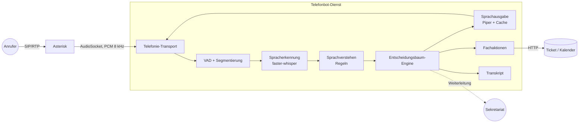

# Architektur

## Überblick

Der Bot nimmt Anrufe über die Telefonanlage entgegen, versteht gesprochene
Antworten, führt den Anrufer durch einen in YAML gepflegten Entscheidungsbaum
und legt am Ende einen Vorgang an oder verbindet mit einem Menschen. Alle
Verarbeitungsschritte laufen auf eigener Hardware.

## Warum diese Aufteilung

**Die Engine kennt kein Audio.** `FlowEngine` ist ein synchroner Zustands-
automat: Eingabe rein, Effekte raus (`Speak`, `Collect`, `Invoke`, `Transfer`,
`Hangup`). Dadurch lässt sich jeder Gesprächspfad in Millisekunden testen, ohne
Telefonanlage und ohne Modelle — die Testsuite nutzt das ausgiebig.

**Alles Austauschbare hängt an einer schmalen Schnittstelle.** ASR, TTS, VAD und
Transport sind Protokolle mit je zwei bis vier Methoden. Whisper gegen ein
anderes Modell zu tauschen heißt: eine Klasse schreiben, eine Zeile in
`config.yaml` ändern. Für Tests stehen Attrappen bereit.

**Der Kern hat keine Fremdabhängigkeiten.** Entscheidungsbaum, Sprachverstehen,
PCM-Verarbeitung, VAD und das AudioSocket-Protokoll sind reine
Standardbibliothek (PyYAML nur zum Laden der Bäume). Das macht Installation und
Betrieb auf einer abgeschotteten Uni-VM erheblich einfacher und hält die
Angriffsfläche klein. Die schweren Pakete (faster-whisper, Piper, onnxruntime)
sind optionale Extras und werden erst beim ersten Gebrauch importiert.

## Module

| Modul | Aufgabe |
|---|---|
| `flow/` | Datenmodell, YAML-Loader, statische Prüfung, Engine, Mermaid-Export |
| `nlu/` | Deutsche Parser (Ja/Nein, Zahlen, Datum, Uhrzeit), Regel-Interpreter |
| `asr/` | Schnittstelle, faster-whisper-Adapter, Attrappe |
| `tts/` | Schnittstelle, Piper-Adapter, Ansagen-Cache, Attrappe |
| `audio/` | PCM (Resampling, WAV, Pegel), VAD und Turn-Taking |
| `telephony/` | AudioSocket-Protokoll und -Server, Fake-Transport, Textsimulator |
| `session/` | Gesprächsschleife, Fachaktionen, Transkript |
| `control/` | Status, Kennzahlen, Weiterleitungsziel für den Dialplan |
| `app.py` | Verdrahtung aus der Konfiguration |

## Ablauf eines Anrufs

1. Asterisk nimmt an und öffnet eine TCP-Verbindung zum AudioSocket-Server.
2. `CallSession` startet die Engine; diese liefert Ansagen und eine Frage.
3. Ansagen gehen durch TTS (meist aus dem Cache) im 20-ms-Takt zurück.
4. Währenddessen läuft die VAD mit: Spricht der Anrufer, wird die Ansage
   abgebrochen (Barge-in) und der bereits erfasste Sprachanfang weiterverwendet.
5. Nach 0,8 s Stille gilt die Äußerung als beendet, Whisper transkribiert.
6. Das Sprachverstehen bildet den Text auf den erwarteten Wert ab
   (`termin`, `2026-03-14`, `12345678`, …), die Engine wählt den nächsten Knoten.
7. Am Ende: Fachaktion, Verabschiedung oder Weiterleitung ans Sekretariat.

## Latenzbudget

Die gefühlte Qualität eines Telefonbots hängt fast nur an der Pause zwischen
Frage und Antwort. Zielwert: **unter 1,5 s**.

| Schritt | Zielwert | Anmerkung |
|---|---|---|
| Endpunkterkennung | 0,8 s | `vad.end_silence_s`, direkt spürbar |
| Spracherkennung | 0,3–1,5 s | modell- und hardwareabhängig |
| Baum + Verstehen | < 5 ms | gemessen, reine Rechenzeit |
| Sprachausgabe | 0 s aus dem Cache, sonst 0,2–0,6 s | feste Ansagen werden vorsynthetisiert |
| Netz/Puffer | ~50 ms | im LAN |

Die ASR- und TTS-Werte sind **Erwartungswerte, keine Messungen** — sie hängen an
GPU, Modellgröße und Auslastung. `scripts/benchmark_asr.py` misst sie auf der
Zielmaschine.

## Bewusste Einschränkungen

* **Kein Streaming-ASR.** Erkannt wird erst, wenn der Anrufer fertig gesprochen
  hat. Das kostet Latenz, ist aber deutlich einfacher und genauer. Bei Bedarf
  lässt sich hinter derselben Schnittstelle ein Streaming-Erkenner einhängen.
* **Kein LLM im Entscheidungspfad.** Der Baum entscheidet, nicht ein Modell.
  Das ist im Uni-/Behördenkontext ein Vorteil: Das Verhalten ist vollständig
  nachvollziehbar und prüfbar. Ein LLM kann optional *klassifizieren*
  (freie Formulierungen auf Menüpunkte abbilden), nie *entscheiden*.
* **Weiterverbinden macht Asterisk.** Über AudioSocket kann der Bot ein Gespräch
  nicht selbst übergeben; er hinterlegt das Ziel in der Control-API, der
  Dialplan holt es ab. Siehe `deploy/asterisk/extensions.conf`.
